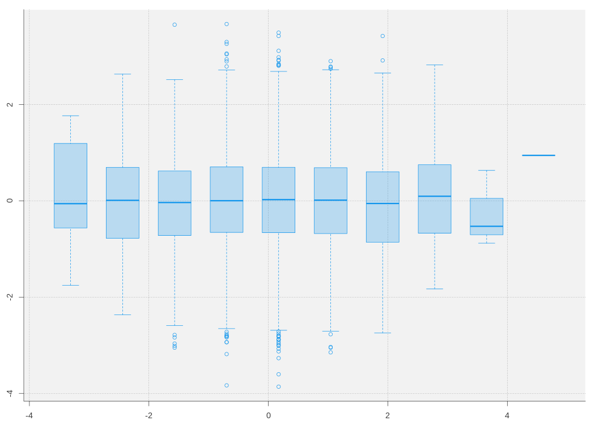
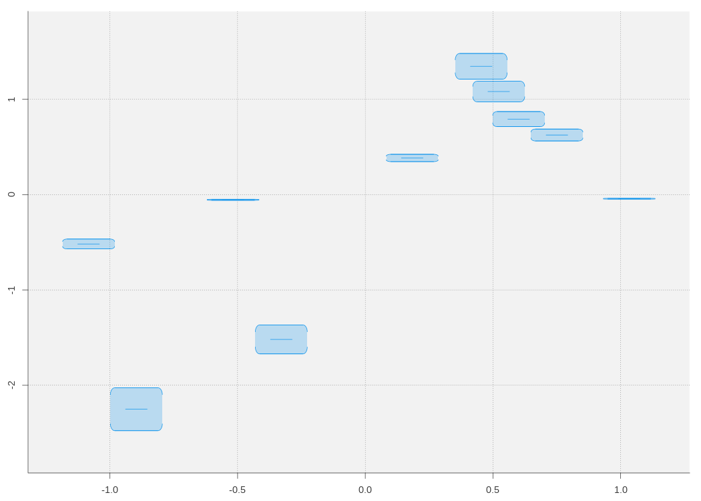
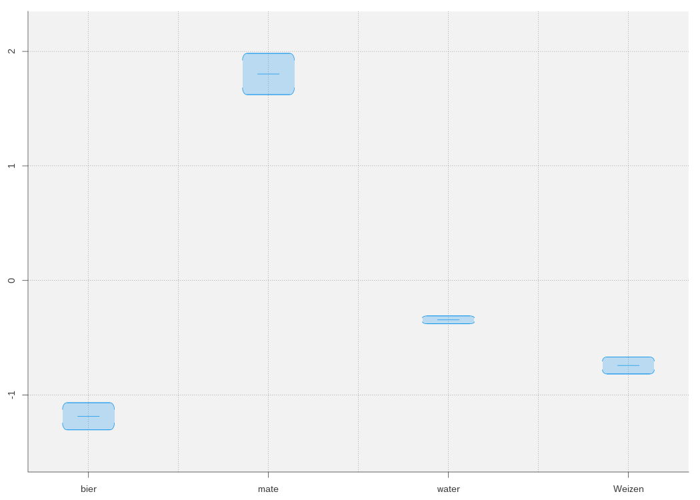
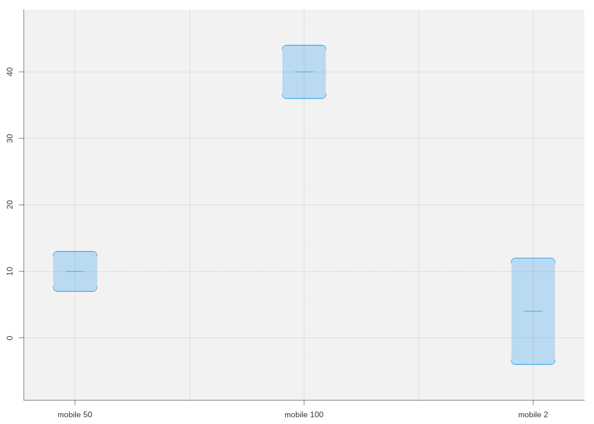
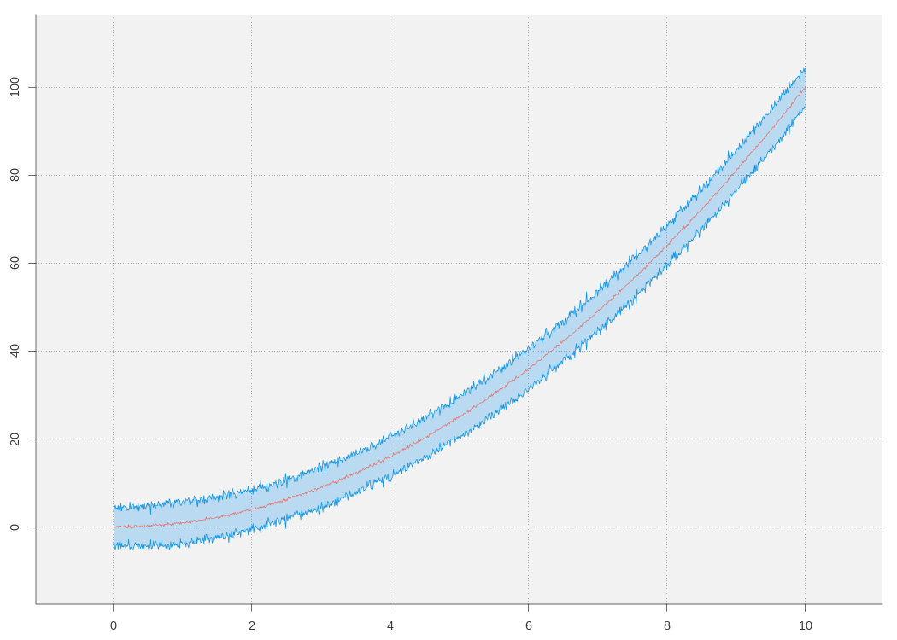

# rPlots

## Description

little scripts to make IMHO nice looking plots :)

# Example






created from 
```
"mobile 50" 10 3
"mobile 100" 40 4
"mobile 2" 4 8
```
where first collum is the name, second the mean and third the confidence interval

## Todo

* Remove duplicate code
* Unify functions
* More options

